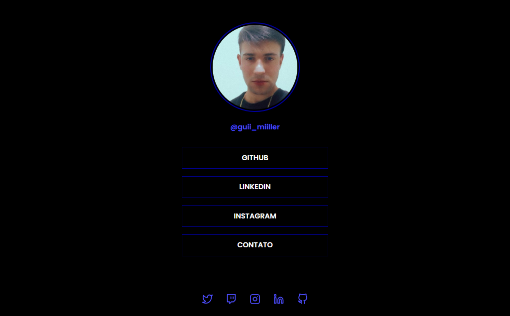

# Social Tree

> Desafio Curso Discover

Projeto Social Tree com modal de contato construído no curso Discover da Rocketseat.

[Clique para acessar](https://guimiiller.github.io/social-tree/)

## 🚀 Tecnologias

- HTML
- CSS
- JavaScript
- Git e Github

## 💻 O que aprendi

- Criar um modal para as pessoas entrar em contato comigo
- Conectar o formulário com o meu email

## 📨 Contato

- guilhermemillerblack@gmail.com